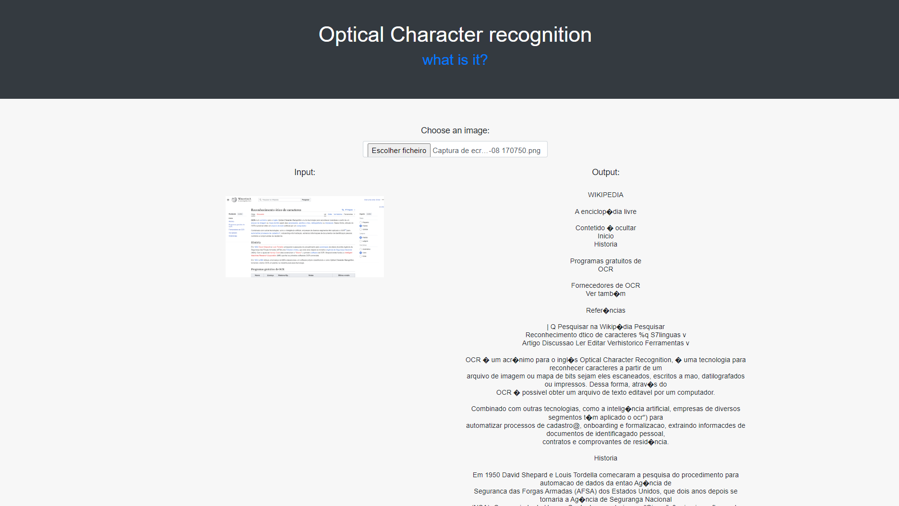
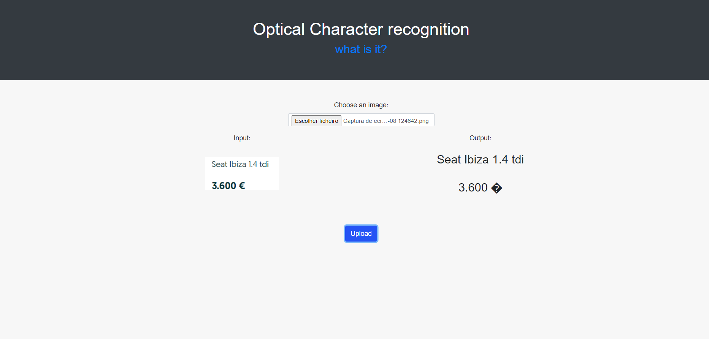

# Optical Character recognition
This is a simple OCR Web App using tesseract, an open source OCR engine.
 
In this app, it was used the "pytesseract" pyton library to handle the text recognition. 
 
 
Contains:
- ES6+ JavaScript
- NodeJS
- ExpressJS
- Bootstrap CSS
- Tesseract
- Python (with a child-process)

# How does it works?
 
The user simply uploads an image using the file uploader, and clicks upload,
all the read text will show up in the output column.

# Known limitations:

- doesn't always work with certain languages eg: portuguese
- sometimes crooked text won't be able to be read
- every limitation found in the tesseract library

  
